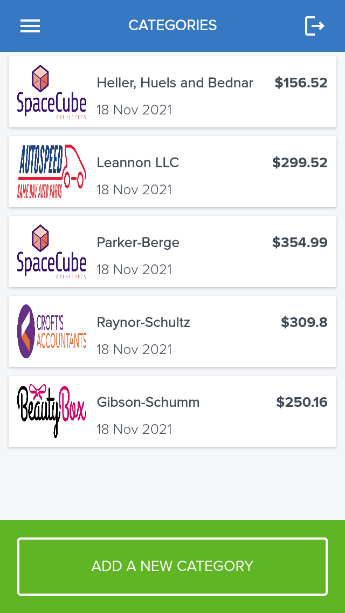

# Budget App


> A mobile web application where you can manage your budget



A mobile web application where you can manage your budget: you have a list of transactions associated with a category, so that you can see how much money you spent and on what.

## Built With

- Ruby on Rails
- PostgreSQL

## Live Link

[Heroku](https://calm-stream-96524.herokuapp.com/)

## Getting Started

To get a local copy up and running follow these simple example steps.

### Prerequisites

- [Ruby](https://www.ruby-lang.org/en/)
- [Rails](https://gorails.com/)

### Setup

- Make sure you have Ruby on Rails set up properly on your computer
- Clone or download this repo on your machine
- Enter project directory

### Install

```sh
bundle install
```

### Database

```sh
# Create user
sudo -u postgres createuser recipe_app -s

# Create the database
rails db:create

## Apply migration
rails db:migrate

# Load the schema
rails db:schema:load
```

### Run

```sh
rails s
```

### Test

```sh
rspec
```

### Troubleshoot

```sh
### Rspec failing
RAILS_ENV=test rake db:reset
```

```sh
### New Scaffold
rails g scaffold_controller model
```

```sh
### Undo migration
rake db:migrate VERSION=0
```

## Authors

👤 **Usman**

- GitHub: [@usmansbk](https://github.com/usmansbk)
- LinkedIn: [Usman Suleiman Babakolo](https://linkedin.com/in/usmansbk)

## 🤝 Contributing

Contributions, issues, and feature requests are welcome!

Feel free to check the [issues page](../../issues/).

## Show your support

Give a ⭐️ if you like this project!

## Acknowledgments

- Microverse
- Original design idea by Gregoire Vella on [Behance](https://www.behance.net/gregoirevella).

## License

[MIT](./LICENSE)
